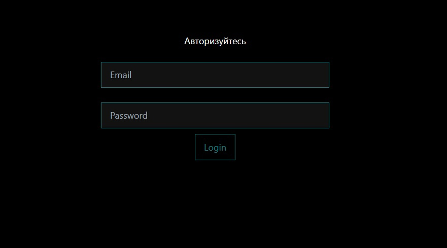
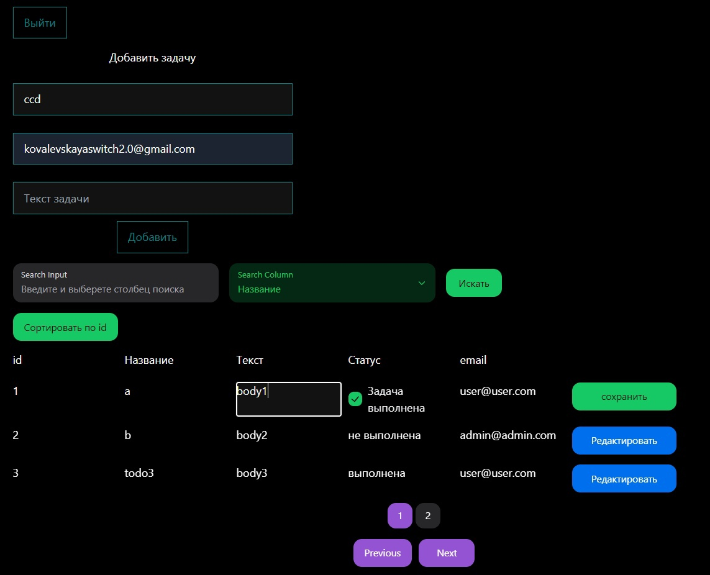

# Next-Profcosmo

## Стек технологий


## Главная страница




## Возможности:

- Авторизация в качестве админа или юзера
- Моковые задачи, комбинации email + password, роль зарегистрировавшегося хранятся в Redux
- Форма добавления новой задачи
- Задачи отображаются с возможностью фильтрации по названию задачи, email, статусу и сортировки по ID
- Редактирование и сохранение изменений существующей задачи в UI таблицы

## Установка

При разработке использовалась версия Node: 18.20.3

### Склонировать репозиторий

```sh
   git clone git@github.com:KovOlga/next-profcosmo.git
```

### Установить зависимости

```sh
   npm install
```

### Запустить проект в режиме разработки на 3000 порту

```sh
   npm run dev
```
